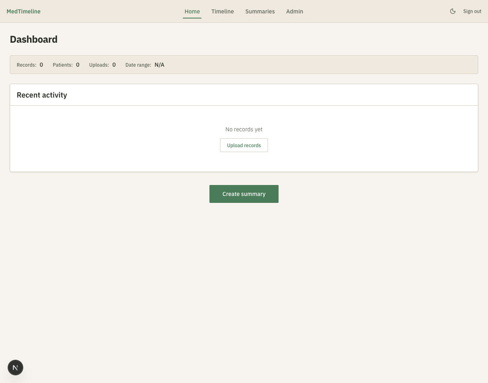

# AI-Enabled Clinical Uploads/Exports

Local-first, HIPAA-compliant clinical data pipeline. Ingests FHIR R4 bundles, Epic EHI exports, and unstructured clinical documents (PDF, RTF, TIFF) into a unified timeline with AI-powered entity extraction and summarization.



<!-- TODO: Create a seeded test account with realistic synthetic clinical data
     (Synthea or similar FHIR-compliant patient generator) for richer screenshots
     and documentation examples. See: https://synthea.mitre.org/ -->

## What it does

- Parses FHIR R4 JSON bundles and Epic EHI Tables (TSV) into a normalized PostgreSQL database
- Extracts text from PDFs, RTFs, and TIFFs via Gemini vision API
- Identifies clinical entities (medications, conditions, labs, vitals, procedures, allergies, providers) with dynamic confidence scoring
- Presents extracted entities for user review before creating FHIR records
- Supports batch upload of multiple unstructured documents
- Displays records on an interactive timeline with category filtering
- Builds de-identified AI prompts for health summarization (prompt-only mode requires no API key)
- Optionally calls Gemini directly for live summarization (text, JSON, or both)
- Detects and resolves duplicate records via exact + fuzzy matching with hash-based bucketing
- Full HIPAA compliance: AES-256 encryption at rest, audit logging on all endpoints, JWT auth with JTI-based token revocation, rate limiting, account lockout

## Architecture

```
                         ┌─────────────────────────────────────────┐
                         │           Next.js Frontend              │
                         │    (Forest Floor theme, 13 retro UI)    │
                         └──────────────────┬──────────────────────┘
                                            │ REST API
                         ┌──────────────────▼──────────────────────┐
                         │          FastAPI Backend                 │
                         │   JWT Auth │ Audit Log │ Rate Limit     │
                         └──┬─────────┬──────────┬─────────────┬───┘
                            │         │          │             │
              ┌─────────────▼──┐  ┌───▼────┐  ┌─▼──────────┐  │
              │  Ingestion     │  │Timeline│  │AI Summary  │  │
              │  Coordinator   │  │Service │  │Prompt Build│  │
              │  ┌───────────┐ │  └───┬────┘  │PHI Scrub   │  │
              │  │FHIR Parser│ │      │       │Gemini API  │  │
              │  │Epic Parser│ │      │       └─────┬──────┘  │
              │  │Text Extrac│ │      │             │         │
              │  │Entity Extr│ │      │             │         │
              │  └───────────┘ │      │             │         │
              └───────┬────────┘      │             │         │
                      │               │             │         │
              ┌───────▼───────────────▼─────────────▼─────────▼───┐
              │         PostgreSQL 16 (pgcrypto AES-256)          │
              │  health_records │ patients │ audit_log │ uploads  │
              └──────────────────────────────────────────────────-┘
```

**Dual-mode AI**: Mode 1 builds de-identified prompts for external use (no API key). Mode 2 calls Gemini directly for summarization and text extraction. All data passes through the PHI scrubber before any AI operation.

## Tech stack

**Backend**: Python 3.12, FastAPI, SQLAlchemy 2 (async), PostgreSQL 16, Alembic, Gemini API, LangExtract

**Frontend**: Next.js 15, TypeScript, Tailwind CSS 4, shadcn/ui, TanStack Query, Zustand, NextAuth.js

## Project structure

```
backend/
├── app/
│   ├── main.py, config.py, database.py
│   ├── middleware/        # auth, audit, encryption, security headers, rate limit
│   ├── models/            # user, patient, record, uploaded_file, ai_summary, dedup, provenance, audit
│   ├── schemas/           # auth, records, timeline, summary, upload, dedup
│   ├── api/               # auth, records, timeline, upload, summary, dedup, dashboard
│   └── services/
│       ├── ingestion/     # coordinator, fhir_parser, epic_parser, epic_mappers/
│       ├── ai/            # prompt_builder, summarizer, phi_scrubber
│       ├── extraction/    # text_extractor, entity_extractor, entity_to_fhir
│       └── dedup/         # detector
├── tests/                 # 13 test files, 157 tests
└── alembic/               # migrations

frontend/src/
├── app/
│   ├── (auth)/            # login, register
│   └── (dashboard)/       # home, timeline, summaries, admin (12-tab console)
├── components/
│   ├── ui/                # shadcn components
│   └── retro/             # 13 custom retro components (Forest Floor theme)
└── lib/                   # api.ts, utils.ts, constants.ts

scripts/                   # init-db.sql, setup-local.sh, pg-tuning.sql, seed_sample_data.py
docs/                      # backend-handoff.md (API contract), screenshots/
```

## Prerequisites

- macOS (tested on Apple Silicon)
- [Homebrew](https://brew.sh)
- PostgreSQL 16 and Redis 7 (`brew install postgresql@16 redis`)
- Python 3.12+ and Node.js 20+

## Quick start

### 1. Infrastructure

```bash
brew services start postgresql@16
brew services start redis
createdb medtimeline
createdb medtimeline_test
psql medtimeline < scripts/init-db.sql
psql medtimeline_test -c "CREATE EXTENSION IF NOT EXISTS pgcrypto;"
```

### 2. Environment

```bash
cp .env.example .env
# Edit .env — set DATABASE_ENCRYPTION_KEY and JWT_SECRET_KEY
# Optionally add GEMINI_API_KEY for live AI features
```

### 3. Backend

```bash
cd backend
pip install -e ".[dev]"
alembic upgrade head
# Also run migrations against the test database:
DATABASE_URL=postgresql+asyncpg://localhost:5432/medtimeline_test alembic upgrade head
uvicorn app.main:app --reload --port 8000
```

### 4. Frontend

```bash
cd frontend
npm install
npm run dev
```

Open [http://localhost:3000](http://localhost:3000).

## Running tests

```bash
cd backend

# Fast tests (no API key needed)
python -m pytest -x -v

# All tests including Gemini API calls
python -m pytest -x -v --run-slow

# HIPAA compliance tests only
python -m pytest tests/test_hipaa_compliance.py -v
```

157 tests across 13 test files covering auth, records, ingestion, extraction, summarization, deduplication, and HIPAA compliance.

**Test database isolation**: Tests run against `medtimeline_test` (auto-derived from `DATABASE_URL` by appending `_test`). The test database must exist and have pgcrypto enabled before running tests. See the infrastructure step above.

## API documentation

Full API contract with request/response schemas: [`docs/backend-handoff.md`](docs/backend-handoff.md)

## Environment variables

See [`.env.example`](.env.example) for all options. The Gemini API key is only required for live summarization and text extraction — prompt-only mode works without it.

## License

[MIT](LICENSE)
