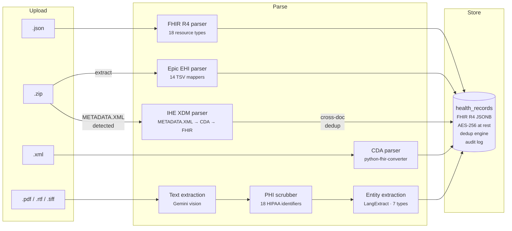
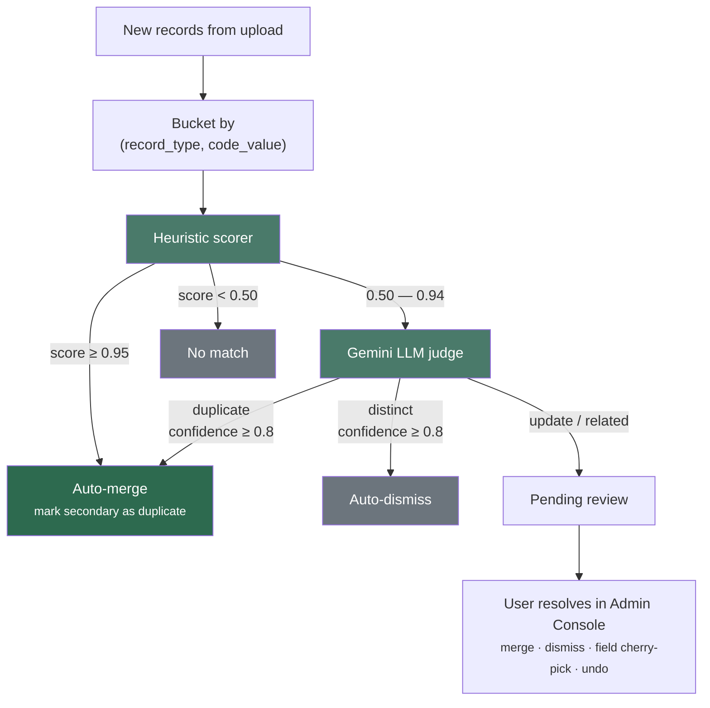
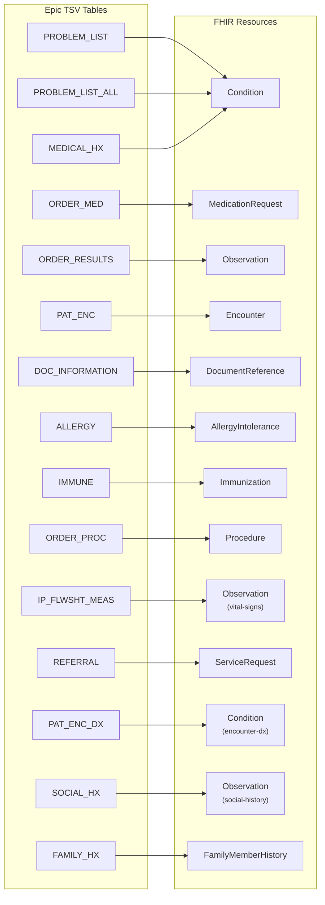
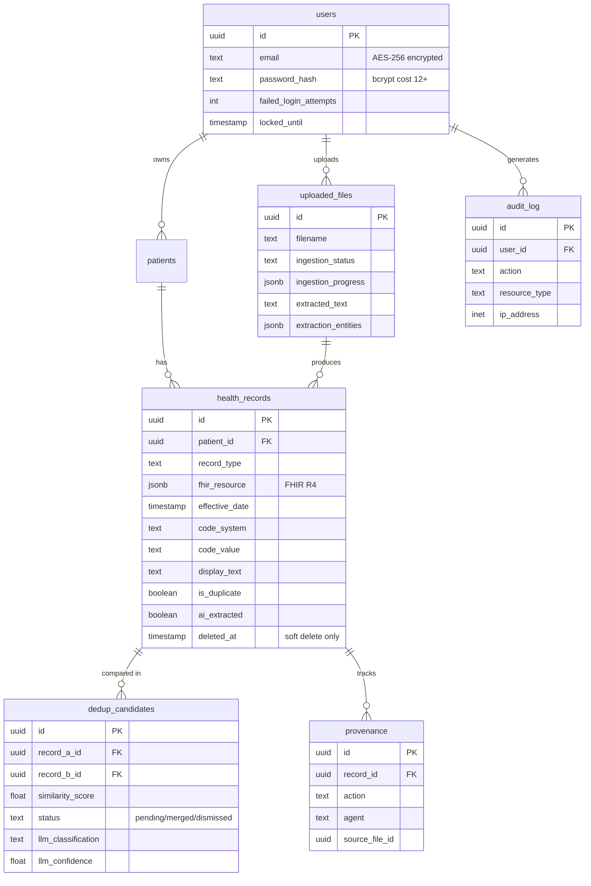

# MedTimeline

Local-first personal health records app. Ingests structured clinical data (FHIR, Epic EHI, CDA XML) and unstructured documents (PDF, RTF, TIFF), normalizes everything into FHIR R4 in PostgreSQL, and displays it on a timeline. AI features are optional — works fine without an API key.

## How data flows


```mermaid
flowchart LR
    subgraph Upload
        JSON[".json"]
        ZIP[".zip"]
        XML[".xml"]
        PDF[".pdf / .rtf / .tiff"]
    end

    subgraph Parse
        FHIR["FHIR R4 parser<br/><small>18 resource types</small>"]
        EPIC["Epic EHI parser<br/><small>14 TSV mappers</small>"]
        XDM["IHE XDM parser<br/><small>METADATA.XML → CDA → FHIR</small>"]
        CDA["CDA parser<br/><small>python-fhir-converter</small>"]
        TXT["Text extraction<br/><small>Gemini vision</small>"]
        ENT["Entity extraction<br/><small>LangExtract · 7 types</small>"]
        PHI["PHI scrubber<br/><small>18 HIPAA identifiers</small>"]
    end

    subgraph Store
        DB[("health_records<br/><small>FHIR R4 JSONB<br/>AES-256 at rest<br/>dedup engine<br/>audit log</small>")]
    end

    JSON --> FHIR --> DB
    ZIP -->|extract| EPIC --> DB
    ZIP -->|"METADATA.XML<br/>detected"| XDM -->|"cross-doc<br/>dedup"| DB
    XML --> CDA --> DB
    PDF --> TXT --> PHI --> ENT --> DB
```

## Dedup pipeline

Every upload triggers a two-tier dedup scan against existing records.


```mermaid
flowchart TD
    NEW["New records from upload"] --> BUCKET["Bucket by<br/>(record_type, code_value)"]

    BUCKET --> HEUR["Heuristic scorer"]

    HEUR -->|"score ≥ 0.95"| AUTO_MERGE["Auto-merge<br/><small>mark secondary as duplicate</small>"]
    HEUR -->|"0.50 — 0.94"| LLM["Gemini LLM judge"]
    HEUR -->|"score < 0.50"| SKIP["No match"]

    LLM -->|"duplicate<br/>confidence ≥ 0.8"| AUTO_MERGE
    LLM -->|"distinct<br/>confidence ≥ 0.8"| AUTO_DISMISS["Auto-dismiss"]
    LLM -->|"update / related"| PENDING["Pending review"]

    PENDING --> USER["User resolves in Admin Console<br/><small>merge · dismiss · field cherry-pick · undo</small>"]

    style AUTO_MERGE fill:#2d6a4f,color:#fff
    style AUTO_DISMISS fill:#6c757d,color:#fff
    style SKIP fill:#6c757d,color:#fff
    style LLM fill:#4a7a6a,color:#fff
    style HEUR fill:#4a7a6a,color:#fff
```

**Heuristic scoring weights:**

| Signal | Weight |
|--------|--------|
| `code_value` match | 0.40 |
| `display_text` similarity | 0.30 |
| `effective_date` proximity | 0.20 |
| `status` match | 0.10 |
| Cross-source bonus | 0.10 |
| `source_section` match | 0.15 |

## Ingestion formats

| Format | File type | What it produces |
|--------|-----------|------------------|
| FHIR R4 Bundle | `.json` | 18 resource types → health_records |
| Epic EHI Tables | `.zip` of `.tsv` | 14 table mappers → FHIR resources |
| CDA XML | `.xml` | ClinicalDocument → FHIR via converter |
| IHE XDM | `.zip` | METADATA.XML manifest → CDA docs → FHIR |
| Unstructured | `.pdf` `.rtf` `.tiff` | Gemini OCR → entity extraction → FHIR |

<details>
<summary>Epic EHI table mappers (14)</summary>


```mermaid
flowchart LR
    subgraph Epic TSV Tables
        PL[PROBLEM_LIST]
        PLA[PROBLEM_LIST_ALL]
        MH[MEDICAL_HX]
        OM[ORDER_MED]
        OR[ORDER_RESULTS]
        PE[PAT_ENC]
        DI[DOC_INFORMATION]
        AL[ALLERGY]
        IM[IMMUNE]
        OP[ORDER_PROC]
        VI[IP_FLWSHT_MEAS]
        RF[REFERRAL]
        PD[PAT_ENC_DX]
        SH[SOCIAL_HX]
        FH[FAMILY_HX]
    end

    subgraph FHIR Resources
        Cond[Condition]
        MedReq[MedicationRequest]
        Obs[Observation]
        Enc[Encounter]
        DocRef[DocumentReference]
        Allergy[AllergyIntolerance]
        Immun[Immunization]
        Proc[Procedure]
        Vital["Observation<br/><small>(vital-signs)</small>"]
        SvcReq[ServiceRequest]
        EncDx["Condition<br/><small>(encounter-dx)</small>"]
        Social["Observation<br/><small>(social-history)</small>"]
        FamHx[FamilyMemberHistory]
    end

    PL --> Cond
    PLA --> Cond
    MH --> Cond
    OM --> MedReq
    OR --> Obs
    PE --> Enc
    DI --> DocRef
    AL --> Allergy
    IM --> Immun
    OP --> Proc
    VI --> Vital
    RF --> SvcReq
    PD --> EncDx
    SH --> Social
    FH --> FamHx
```

</details>

<details>
<summary>FHIR resource types (18)</summary>

Condition, Observation, MedicationRequest, MedicationStatement, AllergyIntolerance, Procedure, Encounter, Immunization, DiagnosticReport, DocumentReference, ImagingStudy, ServiceRequest, CarePlan, Communication, Appointment, CareTeam, ImmunizationRecommendation, QuestionnaireResponse

</details>

## AI modes


```mermaid
flowchart TD
    subgraph "Mode 1: Prompt-only · no API key"
        R1["health_records"] --> S1["PHI scrubber<br/><small>strips 18 HIPAA IDs</small>"]
        S1 --> P1["Build prompt<br/><small>system + user</small>"]
        P1 --> U1["Return copyable text"]
        U1 --> EXT["User pastes into any LLM"]
        EXT -.->|optional| PASTE["Paste response back for storage"]
    end

    subgraph "Mode 2: Live API · needs GEMINI_API_KEY"
        R2["health_records"] --> S2["PHI scrubber"]
        S2 --> P2["Build prompt"]
        P2 --> G["Gemini API"]
        G --> OUT["Return summary<br/><small>text / JSON / both</small>"]
    end

    style S1 fill:#c25550,color:#fff
    style S2 fill:#c25550,color:#fff
    style G fill:#4a7a6a,color:#fff
```

**Summary types:** full, category, date-range, single-record
**Models:** `gemini-3-flash-preview` (summary + OCR), `gemini-2.5-flash` (entity extraction)

## Database


```mermaid
erDiagram
    users ||--o{ patients : owns
    users ||--o{ uploaded_files : uploads
    users ||--o{ audit_log : generates
    patients ||--o{ health_records : has
    uploaded_files ||--o{ health_records : produces
    health_records ||--o{ dedup_candidates : "compared in"
    health_records ||--o{ provenance : tracks

    users {
        uuid id PK
        text email "AES-256 encrypted"
        text password_hash "bcrypt cost 12+"
        int failed_login_attempts
        timestamp locked_until
    }

    health_records {
        uuid id PK
        uuid patient_id FK
        text record_type
        jsonb fhir_resource "FHIR R4"
        timestamp effective_date
        text code_system
        text code_value
        text display_text
        boolean is_duplicate
        boolean ai_extracted
        timestamp deleted_at "soft delete only"
    }

    dedup_candidates {
        uuid id PK
        uuid record_a_id FK
        uuid record_b_id FK
        float similarity_score
        text status "pending/merged/dismissed"
        text llm_classification
        float llm_confidence
    }

    uploaded_files {
        uuid id PK
        text filename
        text ingestion_status
        jsonb ingestion_progress
        text extracted_text
        jsonb extraction_entities
    }

    provenance {
        uuid id PK
        uuid record_id FK
        text action
        text agent
        uuid source_file_id
    }

    audit_log {
        uuid id PK
        uuid user_id FK
        text action
        text resource_type
        inet ip_address
    }
```

All tables use UUID PKs and `created_at`/`updated_at` timestamps. PII encrypted at rest via AES-256/pgcrypto.

## HIPAA controls

| Authentication | Data protection | Monitoring |
|----------------|-----------------|------------|
| bcrypt (cost 12+) | AES-256 at rest | Audit log on all data endpoints |
| JWT 15-min access tokens | PHI scrub before any AI call | Rate limiting |
| 7-day refresh tokens (rotated) | Soft delete only | Account lockout (5 fails) |
| Token revocation (JTI blacklist) | User-scoped queries | 30-min idle timeout |
| Password complexity enforcement | UUID upload filenames | CORS hardening |
| HSTS + CSP + security headers | No PII in error responses | |

## Tech stack

**Backend**: Python 3.12 / FastAPI / SQLAlchemy 2 async / PostgreSQL 16 / Alembic / Gemini API / LangExtract / python-fhir-converter

**Frontend**: Next.js 15 / TypeScript / Tailwind CSS 4 / shadcn/ui / TanStack Query / Zustand / NextAuth.js

**Infra**: PostgreSQL 16 + Redis 7 via Homebrew, macOS. No Docker.

## Project structure

```
backend/
├── app/
│   ├── main.py, config.py, database.py
│   ├── middleware/          # auth, audit, encryption, security headers, rate limit
│   ├── models/              # user, patient, record, uploaded_file, ai_summary, dedup, provenance, audit
│   ├── api/                 # auth, records, timeline, upload, summary, dedup, review, dashboard
│   └── services/
│       ├── ingestion/       # coordinator, fhir_parser, epic_parser, cda_parser, xdm_parser,
│       │                    # cda_dedup, bulk_inserter, epic_mappers/ (14)
│       ├── ai/              # prompt_builder, summarizer, phi_scrubber
│       ├── extraction/      # text_extractor, entity_extractor, section_parser, entity_to_fhir
│       └── dedup/           # detector, orchestrator, llm_judge, field_merger
├── tests/                   # 26 test files, 517 tests
└── alembic/                 # migrations

frontend/src/
├── app/(dashboard)/         # home, timeline, upload (+review), summaries, admin (4-tab), records/[id]
├── components/retro/        # 16 custom components (Mature Zen theme)
└── lib/                     # api.ts, utils.ts, constants.ts
```

## Setup

```bash
# 1. infra
brew services start postgresql@16 && brew services start redis
createdb medtimeline && createdb medtimeline_test
psql medtimeline < scripts/init-db.sql
psql medtimeline_test -c "CREATE EXTENSION IF NOT EXISTS pgcrypto;"

# 2. env
cp .env.example .env
# edit: DATABASE_ENCRYPTION_KEY, JWT_SECRET_KEY
# optional: GEMINI_API_KEY (for live AI features)

# 3. backend
cd backend && pip install -e ".[dev]"
alembic upgrade head
DATABASE_URL=postgresql+asyncpg://localhost:5432/medtimeline_test alembic upgrade head
uvicorn app.main:app --reload --port 8000

# 4. frontend
cd frontend && npm install && npm run dev
# open http://localhost:3000
```

## Tests

```bash
cd backend
python -m pytest -x -v                            # ~440 fast tests
python -m pytest -x -v --run-slow                  # all 517 (needs GEMINI_API_KEY for 7 slow)
python -m pytest tests/test_hipaa_compliance.py -v # HIPAA suite (28 tests)
python -m pytest tests/fidelity/ -v                # fidelity checks (Epic + FHIR + CDA)
```

| Area | Tests | | Area | Tests |
|------|------:|-|------|------:|
| auth | 10 | | ingestion | 59 |
| records | 15 | | pipeline integration | 21 |
| dashboard | 10 | | xdm parser | 8 |
| timeline | 8 | | cda parser + dedup | 16 |
| upload | 10 | | text extraction | 12 |
| summary | 10 | | entity extraction | 39 |
| summarization | 9 | | section parser | 11 |
| unstructured upload | 22 | | dedup (all) | 43 |
| hipaa compliance | 28 | | fidelity (epic/fhir/cda) | 181 |

Tests hit `medtimeline_test` (auto-derived from `DATABASE_URL`). Fidelity tests skip when real-data fixtures are absent.

## API

Full contract: [`docs/backend-handoff.md`](docs/backend-handoff.md)

| Group | Endpoints |
|-------|-----------|
| **Auth** | `POST /auth/register` `/login` `/refresh` `/logout` `GET /auth/me` |
| **Records** | `GET /records` `/records/:id` `/records/search` `DELETE /records/:id` |
| **Timeline** | `GET /timeline` |
| **Dashboard** | `GET /dashboard/overview` `/labs` `/patients` |
| **Upload** | `POST /upload` `/upload/unstructured` `/unstructured-batch` `/trigger-extraction` |
| **Upload status** | `GET /upload/:id/status` `/errors` `/extraction` `/history` `/pending-extraction` `/extraction-progress` |
| **Upload review** | `POST /upload/:id/confirm-extraction` `GET /upload/:id/review` `POST /review/resolve` `/undo-merge` |
| **Dedup** | `GET /dedup/candidates` `POST /dedup/merge` `/dismiss` |
| **AI Summary** | `POST /summary/build-prompt` `/generate` `/paste-response` `GET /summary/prompts` `/prompts/:id` `/responses` |

## License

[MIT](LICENSE)
